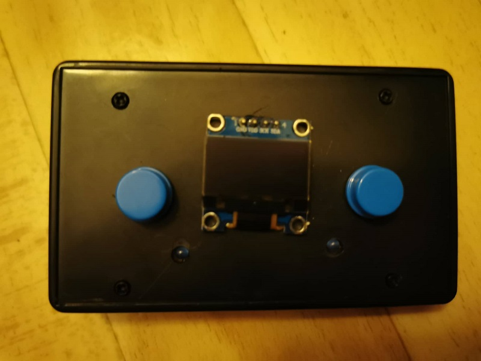
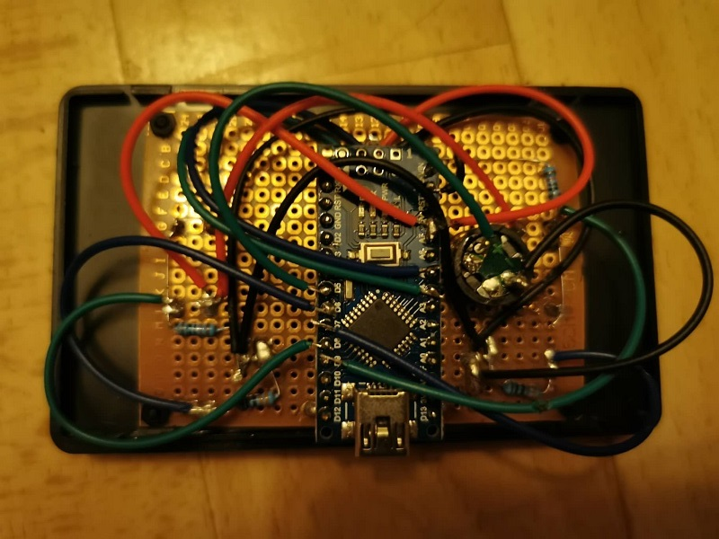
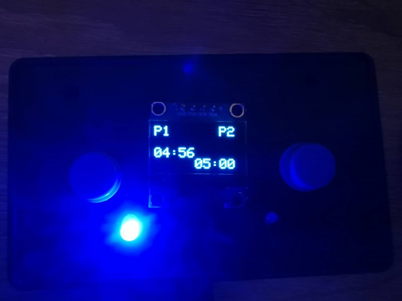

# Chronos
Chronos : Chess Clock with multiple game modes.

The current code was developed to run on an Arduino Nano with an ATmega168.

**Games modes**

* time per player
  * 1 min
  * 3 min
  * 5 min
  * 10 min
  * 20 min
  * 30 min
* time per player with increment each round
  * 1 min + 1s
  * 2 min + 1s
  * 3 min + 2s
* time difference : each player starts with 2.5 minutes and the time he uses passes to the other player

**Circuit**  

*pinout*
* 5 : buzzer
* 6 : led player 2
* 7 : led player 1
* 8 : button player 2
* 9 : button player 1

*parts list :*
* 1 x Arduino Nano
* 2 x pushbutton + 2 x pulldown resistor (e.g. 10KΩ)
* 2 x LED + 2 x resistor for LED (e.g. 300Ω with blue LED)
* 1 x passive buzzer

**Example**
|    |    |
|:--:|:--:|
|  |  |
|  |  |
|  | |
